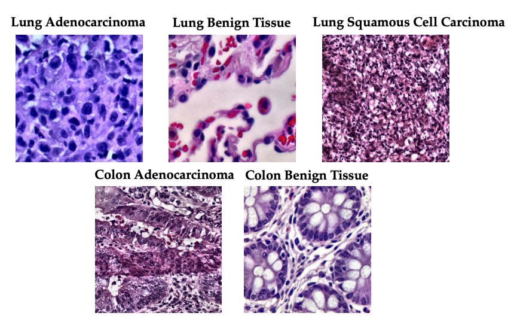

# Enhanced-LC25000-CLAHE-Dataset-Cancer-Classification

This dataset is an enhanced version of the **Lung and Colon Cancer Histopathological Image Dataset (LC25000)** created by **Borkowski et al. (2019)**. The original dataset contains 25,000 histopathological images with 5 classes, including **Colon Adenocarcinoma, Colon Benign Tissue, Lung Adenocarcinoma, Lung Benign Tissue**, and **Lung Squamous Cell Carcinoma**. The images were generated from an original sample of HIPAA-compliant and validated sources, consisting of 750 total images of lung and colon tissue. The dataset was then augmented to 25,000 images using the Augmentor package, with all images in **JPEG format** and of size **768 x 768 pixels**.

## Enhancements:
1. **CLAHE Image Processing:** Contrast Limited Adaptive Histogram Equalization (CLAHE) has been applied to all images to improve contrast and enhance visual features for better classification.
2. **1000 New Images:** To improve dataset variability, 1000 new images have been added to the **Colon Adenocarcinoma, Lung Adenocarcinoma**, and **Lung Squamous Cell Carcinoma** classes. These additional images were sourced from the **National GDC Cancer Portal** and replace some of the original augmented images to create a more robust and generalized dataset.

## Dataset Details:
- **Colon Adenocarcinoma:** 5,000 images
- **Colon Benign Tissue:** 5,000 images
- **Lung Adenocarcinoma:** 5,000 images
- **Lung Benign Tissue:** 5,000 images
- **Lung Squamous Cell Carcinoma:** 5,000 images

## Dataset Download:
The enhanced LC25000 histopathological image dataset is available for download:
- **[Download Enhanced LC25000 Dataset (4.64 GB)]([Google Drive link](https://drive.google.com/drive/folders/1aQNez61naAiuveaQlSzJ2VBsMI5_KUYm?usp=sharing))** 

## Original Dataset:
If you use this dataset in your research, please cite the original authors:
- **Borkowski AA, Bui MM, Thomas LB, Wilson CP, DeLand LA, Mastorides SM. (2019).** Lung and Colon Cancer Histopathological Image Dataset (LC25000). arXiv preprint arXiv:1912.12142. [DOI: https://doi.org/10.48550/arXiv.1912.12142](https://doi.org/10.48550/arXiv.1912.12142).

- **[Original LC25000 Dataset on GitHub](https://github.com/tampapath/lung_colon_image_set)**

## License:
This dataset is licensed under **CC BY-SA 4.0**.
